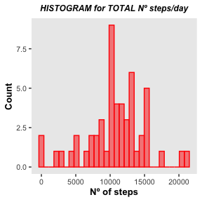
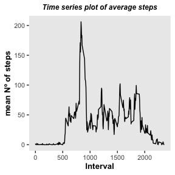
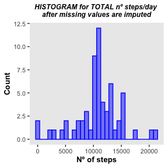
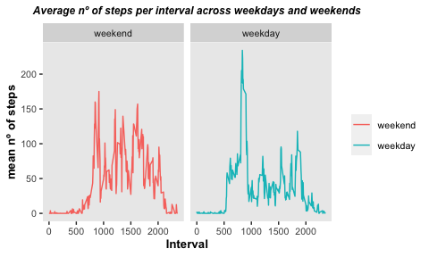

```r
knitr::opts_chunk$set(echo = TRUE)
```

Load libraries

```r
library(ggplot2)
library(dplyr)
```

### Week 2 assignment  
__________________________________________________________________________________________________________________________

**1. Code for reading in the dataset and/or processing the data**

```r
data <- read.csv('activity.csv', sep=',')
data <-transform(data, date=as.Date(date))
processed_data <- data[!is.na(data[1]),]  #select complete data
```
  
  
**2. Histogram of the total number of steps taken each day**

```r
daily_steps <- tapply(processed_data$steps, processed_data$date, sum)  
daily_steps1 <- data.frame(cbind(day = names(daily_steps), steps = daily_steps))
daily_steps1 <- transform(daily_steps1, day= as.Date(day)) 

ggplot(daily_steps1, aes(x=as.numeric(steps))) +
geom_histogram(col='red',fill='red',alpha=0.5) +
labs(title='HISTOGRAM for TOTAL Nº steps/day', x='Nº of steps', y='Count') + 
theme (text = element_text(size=10), 
         plot.title = element_text(size=9, face="bold.italic",hjust = 0.5), 
         axis.title.x = element_text(size=10, face="bold"), 
         axis.title.y = element_text(size=10, face="bold"),
         panel.border = element_blank(),  
         panel.grid.major = element_blank(), 
         panel.grid.minor = element_blank()
         )
```


  
  
**3. Mean and median number of steps taken each day**

```r
mean_xday <- mean(as.numeric(daily_steps1$steps))
median_xday <- median(as.numeric(daily_steps1$steps))
```

- *The mean number of steps taken each day is: 1.0766189\times 10^{4}*
- *The median number of steps taken each day is: 1.0765\times 10^{4}*
  
  
**4. Time series plot of the average number of steps taken**

```r
mean_xinterval <- processed_data%>%group_by(interval)%>%summarise(mean=mean(steps))

ggplot() + geom_line(aes(y = mean, x = interval), data = mean_xinterval)+
labs(title='Time series plot of average steps', x='Interval', y='mean Nº of steps') + 
theme (text = element_text(size=10), 
         plot.title = element_text(size=9, face="bold.italic",hjust = 0.5), 
         axis.title.x = element_text(size=10, face="bold"), 
         axis.title.y = element_text(size=10, face="bold"),
         panel.border = element_blank(),  
         panel.grid.major = element_blank(), 
         panel.grid.minor = element_blank()
         )
```



**5. The 5-minute interval that, on average, contains the maximum number of steps**

```r
maxi <- mean_xinterval%>%filter(mean==max(mean_xinterval$mean))
```
*The 5-minute interval that, on average, contains the maximum number of steps is: 835, 206.1698113*
  
  
**6. Code to describe and show a strategy for imputing missing data**

- Identify missing data

```r
new_data <- data.frame(data) # create a copy of original data to prevent rewriting
data_missing <- is.na(new_data$steps)
#this will create boolean vector for missing data (steps variable)
```

- Mean imputation of missing data  
*Mean imputation (or mean substitution) replaces missing values of a certain variable by the mean of non-missing cases of that variable*

```r
new_data$steps[data_missing] <- mean(new_data$steps, na.rm = TRUE)
```
  
  
**7. Histogram of the total number of steps taken each day after missing values are imputed**

```r
daily_newsteps <- tapply(new_data$steps, new_data$date, sum)
daily_newsteps1 <- data.frame(cbind(day = names(daily_newsteps), steps = daily_newsteps))
daily_newsteps1 <- transform(daily_newsteps1, day= as.Date(day)) 

ggplot(daily_newsteps1, aes(x=as.numeric(steps))) +
geom_histogram(col='blue',fill='blue',alpha=0.5) +
labs(title='HISTOGRAM for TOTAL nº steps/day \nafter missing values are imputed', x='Nº of steps', y='Count') + 
  theme (text = element_text(size=10), 
         plot.title = element_text(size=9, face="bold.italic",hjust = 0.5), 
         axis.title.x = element_text(size=10, face="bold"), 
         axis.title.y = element_text(size=10, face="bold"),
         panel.border = element_blank(),  
         panel.grid.major = element_blank(), 
         panel.grid.minor = element_blank()
         )
```



**8. Panel plot comparing the average number of steps taken per 5-minute interval across weekdays and weekends **   
_Since there is no mention to which dataframe we should use (original data, or NA-imputed data), I decided to use the original data_

```r
weekdays <- c("Monday", "Tuesday", "Wednesday", "Thursday", "Friday")
processed_data$day_of_week <- weekdays(processed_data$date)
processed_data$type_of_day <- factor(processed_data$day_of_week %in% weekdays,
         levels = c(FALSE, TRUE),
         labels = c("weekend", "weekday"))

d_of_week_mean <- processed_data%>%group_by(type_of_day,interval)%>%summarise(mean=mean(steps))
```

```
## `summarise()` has grouped output by 'type_of_day'. You can override using the `.groups` argument.
```

```r
f <- ggplot(aes(interval, mean), data=d_of_week_mean) +
  geom_line(aes(color=type_of_day)) +
  facet_grid(.~type_of_day) +
  labs(title='Average nº of steps per interval across weekdays and weekends', x='Interval', y='mean nº of steps') + 
  theme (text = element_text(size=10), 
         legend.title = element_blank(),
         plot.title = element_text(size=9, face="bold.italic",hjust = 0.25), 
         axis.title.x = element_text(size=10, face="bold"), 
         axis.title.y = element_text(size=10, face="bold"),
         panel.border = element_blank(),  
         panel.grid.major = element_blank(), 
         panel.grid.minor = element_blank()
         )

f
```




